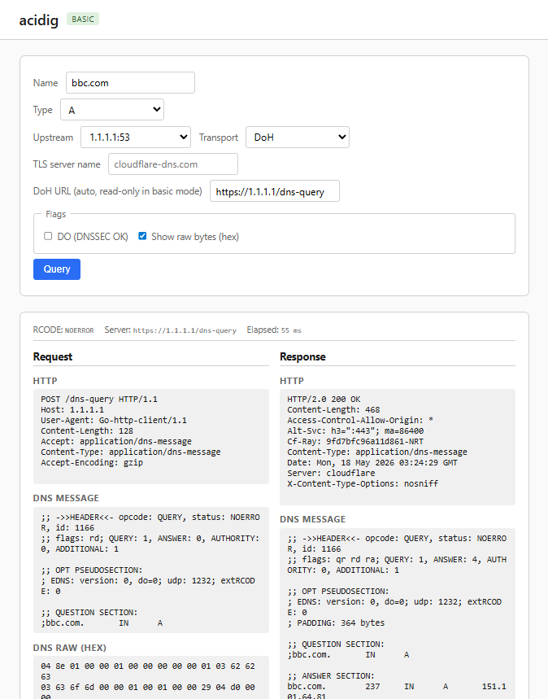

# acidns

A re-imagining of a DNS toolkit for Go, in the style of
[`lestrrat-go/jwx`](https://github.com/lestrrat-go/jwx).

```
go get github.com/lestrrat-go/acidns
```

## Features

- **Wire codec** — hand-written RFC 1034/1035 encoder/decoder with EDNS0,
  DNSSEC, SVCB/HTTPS, EDNS Cookies, Extended Errors, Padding, ZONEMD, and
  ~40 other RR types. No reflection.
- **Resolvers** — stub resolver, iterative recursive resolver (RFC 2308
  negative caching, lame-server detection, QNAME minimisation, aggressive
  NSEC caching, per-upstream rate limiting, root priming), plus the
  `LookupHost` / `ResolveAs[T]` convenience helpers.
- **Transports** — UDP, TCP (with RFC 7766 keep-alive + RFC 7828 idle
  hints), DoT (RFC 7858, with SPKI pinning), DoH (RFC 8484), DoQ
  (RFC 9250, with SPKI pinning), DNSCrypt v2.
- **Server framework** — pluggable `Handler` / `ResponseWriter`, ACL,
  rate-limit, response-rate-limit (RRL), and Cookies middleware;
  authoritative master-file backend; caching forwarder; recursive
  resolver. All share one `Handler` interface.
- **Zones** — RFC 1035 master-file parser and writer with `$ORIGIN`,
  `$TTL`, `$INCLUDE`, `$GENERATE` (RFC 3597 unknown-type support).
- **DNSSEC** — verification primitives plus a chain-of-trust validator
  with NTA store, NSEC/NSEC3 denial-of-existence, wildcard
  closest-encloser proofs, RFC 6840 §5.11 algorithm-rollover check,
  RFC 9276 NSEC3 iteration cap.
- **Zone transfers** — AXFR (RFC 5936) and IXFR (RFC 1995) clients with
  multi-message streaming and RFC 8945 envelope-bound TSIG verification.
- **Spec helpers** — NOTIFY (RFC 1996), dynamic update (RFC 2136), TSIG
  (RFC 8945), SIG(0) (RFC 2931), DDR (RFC 9462), AMT relay discovery
  (RFC 8777), mDNS browse + publish (RFC 6762/6763).
- **CLIs** — `cmd/acidig` (a dig-style tool) and `cmd/acidns-server`
  (authoritative / recursive / hybrid daemon).

## Quick start

```go
package main

import (
    "context"
    "fmt"

    "github.com/lestrrat-go/acidns"
)

func main() {
    r, err := acidns.SystemResolver()
    if err != nil {
        panic(err)
    }
    addrs, err := acidns.LookupHost(context.Background(), r, "example.com.")
    if err != nil {
        panic(err)
    }
    for _, a := range addrs {
        fmt.Println(a)
    }
}
```

`SystemResolver` reads `/etc/resolv.conf`. To pin specific upstreams instead:

```go
r, err := acidns.NewResolver(
    acidns.WithServers(netip.MustParseAddrPort("1.1.1.1:53")),
)
```

To use an encrypted transport:

```go
ex, err := dot.NewExchanger("1.1.1.1:853", dot.WithServerName("one.one.one.one"))
if err != nil { panic(err) }
r, err := acidns.NewResolver(acidns.WithExchanger(ex))
```

## Typed accessors

Records are concrete structs with strongly typed accessors — no `interface{}`:

```go
addrs, err := acidns.ResolveAs[rdata.A](ctx, r, wire.MustParseName("example.com"))
for _, a := range addrs {
    fmt.Println(a.Addr())
}
```

Many-case dispatch uses a Go type switch:

```go
switch v := rec.RData().(type) {
case rdata.A:    fmt.Println("A", v.Addr())
case rdata.AAAA: fmt.Println("AAAA", v.Addr())
case rdata.MX:   fmt.Println("MX", v.Priority(), v.Target())
}
```

## Servers

```go
h := acidns.HandlerFunc(func(ctx context.Context, w acidns.ResponseWriter, q wire.Message) {
    resp, _ := wire.NewMessageBuilder().ID(q.ID()).Response(true).Build()
    _ = w.WriteMsg(resp)
})
srv, err := acidns.NewUDPServer(netip.MustParseAddrPort("127.0.0.1:5353"), h)
if err != nil { panic(err) }
_ = srv.Run(ctx)
```

The `forward/` package is a caching forwarder; `authoritative/` serves a
master-file zone; `recursive/` is an iterative resolver. They all satisfy
the same `Handler` interface and compose with the ACL and rate-limit
middleware in the root package.

## Web UI (`acidig --web`)

`acidig` ships an embedded web UI for inspecting DNS exchanges.




Run it without arguments and it binds `127.0.0.1:8053` and seeds the upstream
dropdown with public resolvers that speak every transport (Cloudflare,
Google, Quad9):

```
acidig --web
```

The page renders a form (name, type, upstream, transport, EDNS DO bit)
and a side-by-side **Request / Response** panel that shows the actual
wire exchange in dig-style format: header, flags, ARCOUNT, EDNS OPT
PSEUDOSECTION (with NSID / ECS / cookies / padding / extended-error
decoded), question, answer, authority, additional. Tick **Show raw
bytes (hex)** to add the on-the-wire bytes underneath each side. For
DoH the panel also shows the HTTP envelope (method, URL, status,
headers) so you can see the layer-7 wrapper around the DNS payload.

Transports work zero-config:

- **UDP / TCP** on port 53.
- **DoT** auto-bumps the port to 853 and resolves the TLS server name
  from a well-known map (1.1.1.1 → `cloudflare-dns.com`, etc.); falls
  back to encrypted-but-unverified TLS when the IP isn't a known DoT
  endpoint.
- **DoH** auto-derives `https://<ip>/dns-query` from the selected
  upstream IP (works for resolvers whose certs have the IP in SAN).

### Basic vs advanced mode

`--web` runs the basic mode: curated query types (A, AAAA, MX, TXT, NS,
SOA, CNAME, PTR, SRV, CAA, HTTPS, SVCB), upstreams limited to the
configured allow-list, no AXFR / ANY / UPDATE, no free-form DoH URL.

```
acidig --web-advanced
```

Implies `--web` and unlocks: any RR type including ANY / AXFR / IXFR /
`TYPEnnn`, free-form upstream entry, transport selector with editable
DoH URL, custom EDNS options, and the raw wire dump enabled by default
without the toggle.

### Flags

| Flag | Description |
|------|-------------|
| `--web` | start the UI in basic mode |
| `--web-advanced` | implies `--web`, unlock dangerous features |
| `--web-listen ADDR` | override default `127.0.0.1:8053` |
| `--web-upstream HOST:PORT` | append to the dropdown (repeatable); also approved for basic-mode queries |
| `--web-no-defaults` | suppress the always-on public-resolver seed (1.1.1.1, 8.8.8.8, 9.9.9.9) |

The server binds 127.0.0.1 only — basic mode is a guard against
operator footguns (zone enumeration, accidental UPDATE, free-form
upstreams), not a remote-attacker boundary.

## Supported RFCs

See [CLAUDE.md](./CLAUDE.md#supported-rfcs) for the full status matrix
(Implemented / Partial / Followed / Out of scope) with per-RFC
implementation notes.

### Basic operations

- **RFC 1034** — Domain Names — Concepts and Facilities
- **RFC 1035** — Domain Names — Implementation and Specification
- **RFC 1183** — Deprecated RR types (RP, AFSDB, X25, ISDN, RT)
- **RFC 1348 / 1706** — NSAP / NSAP-PTR
- **RFC 1876** — LOC record
- **RFC 1982** — Serial Number Arithmetic
- **RFC 2181** — Clarifications to the DNS Specification
- **RFC 2230** — Key Exchange Delegation (KX)
- **RFC 2308** — Negative Caching of DNS Queries
- **RFC 2782** — Service Location (SRV)
- **RFC 2915 / 3401–3403** — NAPTR
- **RFC 2929 / 6895** — DNS IANA Considerations
- **RFC 2930** — Secret Key Establishment (TKEY)
- **RFC 3123** — APL record
- **RFC 3596** — IPv6 (AAAA)
- **RFC 3597** — Unknown DNS RR Types
- **RFC 4025** — IPSECKEY
- **RFC 4255** — SSHFP
- **RFC 4343** — Case insensitivity
- **RFC 4398** — CERT
- **RFC 4408** — SPF record
- **RFC 4592** — Wildcard label semantics
- **RFC 4701** — DHCID
- **RFC 4892** — id.server / hostname.bind (CHAOS class)
- **RFC 5205** — HIP record
- **RFC 6672** — DNAME Redirection
- **RFC 6742** — ILNP (NID, L32, L64, LP)
- **RFC 6761** — Special-Use Domain Names
- **RFC 6762** — Multicast DNS (mDNS)
- **RFC 6763** — DNS-Based Service Discovery (DNS-SD)
- **RFC 6891** — Extension Mechanisms for DNS (EDNS(0))
- **RFC 7043** — EUI48 / EUI64
- **RFC 7314** — EDNS EXPIRE option
- **RFC 7344** — DNSSEC delegation trust maintenance (CDS, CDNSKEY)
- **RFC 7553** — URI record
- **RFC 7766** — DNS Transport over TCP
- **RFC 7828** — edns-tcp-keepalive
- **RFC 7871** — EDNS Client Subnet
- **RFC 7873 / 9018** — DNS Cookies
- **RFC 7929** — DANE OpenPGP (OPENPGPKEY)
- **RFC 8490** — DNS Stateful Operations (partial)
- **RFC 8499** — DNS Terminology
- **RFC 8777** — DNS Reverse IP AMT Discovery
- **RFC 8914** — Extended DNS Errors
- **RFC 8976** — ZONEMD
- **RFC 9461** — SVCB Mapping for DNS Servers
- **RFC 9462** — Discovery of Designated Resolvers (DDR)
- **RFC 9567** — DNS Error Reporting
- **RFC 9606** — DNS Resolver Information (RESINFO)
- **RFC 9660** — DNS Zone Version Option

### Update operations

- **RFC 1995** — Incremental Zone Transfer (IXFR)
- **RFC 1996** — NOTIFY
- **RFC 2136** — Dynamic Updates
- **RFC 2317** — Classless IN-ADDR.ARPA Delegation
- **RFC 5936** — DNS Zone Transfer Protocol (AXFR)
- **RFC 7477** — Child-to-Parent Synchronization (CSYNC)
- **RFC 8764** — Apple's DNS Long-Lived Queries (partial)
- **draft-sekar-dns-ul** — DNS Update Leases

### Secure DNS

- **RFC 2537 / 3110** — RSAMD5 / RSA SIG/KEY (legacy)
- **RFC 2931** — SIG(0)
- **RFC 3007** — Secure Dynamic Update
- **RFC 3445** — Limiting the Scope of (DNS)KEY
- **RFC 4034** — DNSSEC Resource Records (DNSKEY, RRSIG, NSEC)
- **RFC 4035** — DNSSEC Protocol Modifications
- **RFC 4509** — SHA-256 in DS
- **RFC 5155** — NSEC3 (hashed authenticated denial of existence)
- **RFC 5702** — RSA/SHA-2 in DNSSEC
- **RFC 6605** — ECDSA in DNSSEC
- **RFC 6698** — DANE (TLSA)
- **RFC 6840** — DNSSEC clarifications
- **RFC 6844 / 8659** — CAA
- **RFC 6944** — DNSKEY algorithm implementation status
- **RFC 6975** — Signaling cryptographic algorithm understanding
- **RFC 7858** — DNS over TLS (DoT)
- **RFC 8080** — Ed25519 / Ed448 in DNSSEC
- **RFC 8162** — DANE S/MIMEA
- **RFC 8484** — DNS over HTTPS (DoH)
- **RFC 8624** — DNSSEC algorithm implementation requirements
- **RFC 8945** — TSIG
- **RFC 9250** — DNS over QUIC (DoQ)
- **RFC 9460** — SVCB and HTTPS Resource Records
- **draft-ietf-dnsop-compact-denial-of-existence** — Compact Denial of Existence (partial)
- **DNSCrypt v2** — Trusted DNS Queries (non-IETF)

### Recursive resolver behaviour

The recursive resolver implements RFC 1034/1035 iterative resolution
with: RFC 7816 / 9156 QNAME minimisation (default on), RFC 8198
aggressive NSEC caching (NSEC and NSEC3, opt-in via `WithValidator`),
RFC 8109 root priming with periodic refresh, RFC 6891 EDNS UDPSize=1232
with TC=1 → TCP fall-back, RFC 2308 §5 negative caching capped at SOA
MINIMUM, per-upstream rate limiting, smoothed-RTT-and-failure-streak
server selection, parallel A/AAAA address resolution, and (opt-in)
RFC 4035 DNSSEC validation with bogus → SERVFAIL + EDE 6.

## Documentation

- Per-package godoc: `go doc github.com/lestrrat-go/acidns/<pkg>`.
- Runnable examples: see [`examples/`](./examples/).
- RFC support matrix and design philosophy: [CLAUDE.md](./CLAUDE.md).

## License

MIT.
